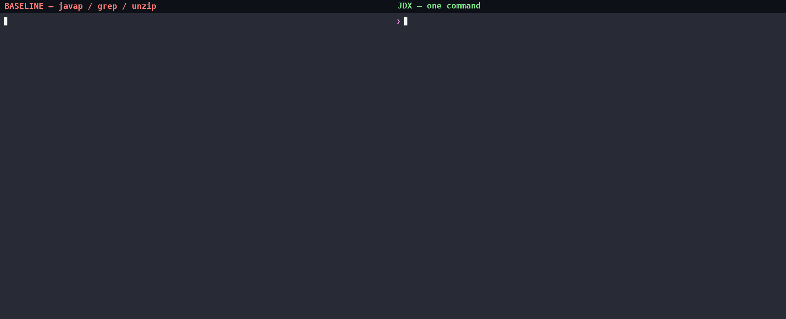
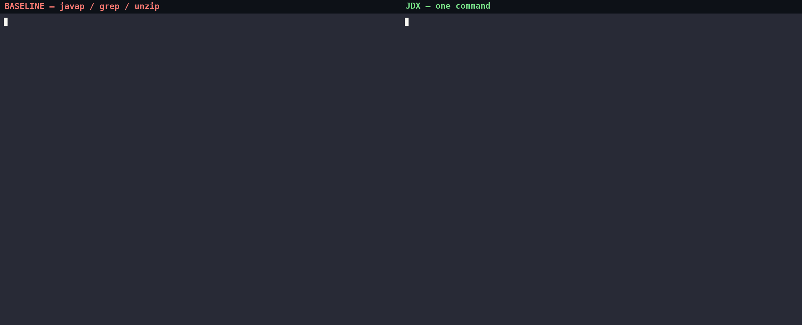

# `jdx` — an IDE for AI agents

[](https://github.com/MohammadMD1383/jdx/releases)
[](LICENSE)
[](https://github.com/MohammadMD1383/jdx/actions/workflows/release.yml)

## Try it in 30 seconds

```bash
curl -fsSL https://raw.githubusercontent.com/MohammadMD1383/jdx/main/install-release.sh | bash
jdx members java.util.HashMap --limit 5
# MCP (Claude Code / Cursor): {"mcpServers":{"jdx":{"command":"jdx","args":["mcp"]}}}
```

---

An AI agent working on a JVM codebase spends most of its time — and most of its context
window — answering questions a human answers in an IDE with one keystroke:

*What methods does this class have? What does this method actually do? Who calls it?
What implements this interface?*

Today an agent answers those with `unzip`, `javap`, `grep`, and by reading 1,400-line source
files into its context. It is slow, noisy, and expensive, and `javap` gives it erased
signatures and raw opcodes.

`jdx` answers them directly — from `.jar`, `-sources.jar`, class directories, source
directories, Maven coordinates, and the JDK itself:

```console
$ jdx members java.util.HashMap --limit 5
members of java.util.HashMap
constructors declared on java.util.HashMap:
  constructor public HashMap()
  constructor public HashMap(int initialCapacity)
  ...
5 of 54 members shown (--limit 54 to see more)
source: java.base (jrt)

$ jdx body 'java.util.HashMap#get(java.lang.Object)'
java.util.HashMap#get(java.lang.Object)
  source: decompiled by vineflower from java.base · java/util/HashMap.java:178-182  ⚠ reconstructed
   @Override
   public V get(Object key) {
      Node<K, V> e;
      return (e = this.getNode(key)) == null ? null : e.value;
   }
```

No sources jar? It decompiles with Vineflower — and **says so**, so the agent knows it is
reading a reconstruction (pass `--engine javap` for raw opcodes instead).

> **Proof, not promises.** One real task — *list Gson's API, then show only
> `toJson(Object)`* — measured on gson-2.14.0:
>
> | | calls | bytes in context (~tokens) |
> |---|---|---|
> | `unzip` + `javap` + `grep` + `sed` | 5 | ~17.5 KB (~4.4k) — and `head -200` misses the method (line 542 of 1265) |
> | `jdx members` + `jdx body` | **2** | **~4.6 KB (~1.2k)** — exact method, 267 bytes (~67 tokens) |
>
> The body alone: **267 bytes vs 60,590 (`javap -c`, 226×) vs 58,251 (full
> `Gson.java`, 218×)**. Tokens ≈ bytes/4. Reproduce it: `sh docs/bench-compare.sh`.

Same task, two agents — left does it with `javap`/`grep`, right with `jdx`:



<details>
<summary>More side-by-side demos (method body · implementors · Maven coordinates)</summary>





</details>

## Install

Requires **JDK 21+**. Every push of a `vX.Y.Z` tag publishes per-OS bundles as
[GitHub Releases](https://github.com/MohammadMD1383/jdx/releases) —
`jdx-<version>-<os>.tar.gz` and `jdx-<version>-<os>.zip` (`<os>` is `linux`,
`macos`, or `windows`), each with a `.sha256` checksum and a `jdx.jsa`
trained on that OS:

```bash
curl -fsSL https://raw.githubusercontent.com/MohammadMD1383/jdx/main/install-release.sh | bash
```

Installs per-user into `~/.local/share/jdx` and links `~/.local/bin/jdx`.
Prefer the `.zip` on Windows (Explorer/Defender are zip-first) — download the
`-windows.zip` asset and install it with
`sh install-release.sh --tarball jdx-<version>-windows.zip`.
Verify with `jdx version` (`jdx doctor` reports JDK, cache, index, Kotlin
sidecar, daemon, and workspace status). Release installs self-update with
`jdx upgrade`. Building from source: `./gradlew :app:installDist && ./install.sh`
(see [`CONTRIBUTING.md`](CONTRIBUTING.md)).

> Releases are **unsigned**: Windows SmartScreen and macOS Gatekeeper will warn
> on first run. `Unblock-File jdx.bat` (PowerShell) or
> `xattr -d com.apple.quarantine <install-dir>/jdx` clears it. Details and the
> asset table live in `docs/PROPOSAL.md` §17.2.

## Quickstart

```bash
# No setup: the running JDK is always on the classpath via jrt:/
jdx members java.util.HashMap --inherited --limit 10
jdx body 'com.google.gson.Gson#toJson(Object)' --jars gson.jar

# Name a classpath once, reuse it everywhere (incl. daemon/MCP/HTTP/batch)
jdx ws create fx --jars 'libs/*.jar' --src ./src
jdx -w fx usages 'com.example.Service#run()'

# Maven coordinates resolve from ~/.gradle/caches + ~/.m2 first;
# --fetch downloads from Maven Central (with -sources.jar) when allowed
jdx show com.google.gson.Gson --coord com.google.code.gson:gson:2.14.0 --fetch

# Token budgets for the biggest listings (text only; --json bytes are unaffected)
jdx members java.util.HashMap --inherited --brief --max-lines 20

# Warm path: start once, query at ~20 ms instead of ~250 ms cold
jdx daemon start -w fx
jdx -w fx members 'com.example.Service'   # served warm automatically

# One process, many queries
echo '{"command":"show","query":"java.util.Map"}' | jdx batch --jars gson.jar
```

## What makes it an *IDE*, not a better `javap`

- **Inherited members resolved transitively**, with generic substitution — the agent
  never walks a class hierarchy by hand again.
- **A real index**, so *find usages*, *implementors*, and *call hierarchy* work across an
  entire classpath, not just one jar.
- **Sources when they exist, decompilation when they don't** — uniformly, behind one command.
- **True Kotlin signatures** from `@Metadata`: `suspend`, properties, default arguments,
  `@JvmName` mappings — not the misleading JVM projection.
- **Javadoc/KDoc**, including documentation inherited from a supertype.
- **`jdx samples`** — real call sites from the classpath as usage examples. Evidence instead
  of recollection.

## What makes it *for agents*, not for humans

- **Minimal correct output.** Bounded, with an explicit hint for getting the rest. Never a
  file dump when a method was asked for.
- **Never guesses.** An ambiguous reference exits `2` and lists every candidate as a
  copy-pasteable reference.
- **Machine-legible outcomes.** Distinct exit codes for *not found*, *ambiguous*,
  *no index*, *bad usage* — branch without parsing prose. `--json` for everything.
- **Provenance on every answer** — which jar, sources or bytecode, which decompiler.
- **`jdx batch`** — many queries, one process, one index load.
- **Four front-ends over one engine:** one-shot CLI, MCP server, a daemon, and a local HTTP/JSON API.
- **`jdx help --agent`** — a compact paste-ready block for `CLAUDE.md` / system prompts.

## Full command reference

The catalogue lives in [`docs/COMMANDS.md`](docs/COMMANDS.md) — every command, flag,
exit code, and the symbol-reference grammar. `jdx <command> --help` documents each
command; `jdx help --agent` prints the compact agent block.

## Known limitations (by design)

Graph queries re-scan live bytecode roots per query (no persistent-index acceleration
yet); call hierarchy is exact name+descriptor matching, not override-aware. Full list in
[GitHub Issues](https://github.com/MohammadMD1383/jdx/issues). Out-of-scope for v1
(API diff, mappings/remap, resources inspection, …) is the phase-2 backlog, also tracked
there.

## Documentation

| | |
|---|---|
| [`docs/COMMANDS.md`](docs/COMMANDS.md) | Full command reference (flags, exit codes, symbol grammar) |
| [`AGENTS.md`](AGENTS.md) (+ per-module `AGENTS.md`) | Contributor notes: architecture rules, gotchas, build/test |
| [`docs/PROPOSAL.md`](docs/PROPOSAL.md) | Full design specification (Appendix B is the flag reference) |
| [`docs/TESTING.md`](docs/TESTING.md) | Testing strategy — required reading before writing tests |
| [`CONTRIBUTING.md`](CONTRIBUTING.md) | Conventions, code style, definition of done |
| [GitHub Issues](https://github.com/MohammadMD1383/jdx/issues) | Limitations, caveats, and the phase-2 backlog |

## Contributing

Contributors here — human and AI — do not share memory. Read
[`CONTRIBUTING.md`](CONTRIBUTING.md) before your first change; it is short and it explains the
documentation discipline that keeps the project resumable by anyone.

## License

Apache-2.0 (see `LICENSE`). Bundled third-party components and their licenses are listed in
`docs/PROPOSAL.md` §19 and will be reproduced in `NOTICE`.
